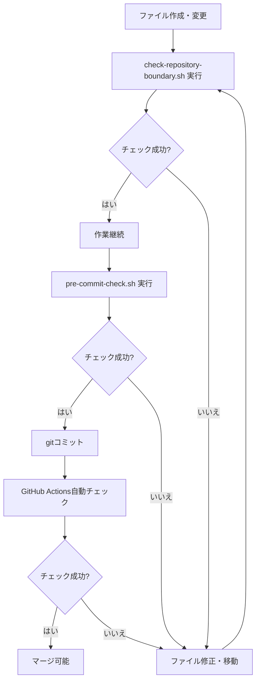

# 混入防止ガイド - リポジトリ境界を守るための運用マニュアル

## 🎯 目的
開発プロジェクトのコードがClaude-Code-Communicationに混入することを**自動的に防ぐ**

## 🛡️ 3層防御システム

### 第1層: 開発時チェック（手動）
**使用タイミング**: 新規ファイル作成・変更時

```bash
cd /home/planj/Claude-Code-Communication
./check-repository-boundary.sh
```

**チェック内容**:
- ✅ 開発プロジェクトコードの混入検出
- ✅ データベースファイルの混入検出
- ✅ プロジェクト固有のテストファイル検出
- ✅ 機密情報ファイルの検出
- ✅ 必須ファイルの存在確認
- ✅ 不適切な命名パターン検出

### 第2層: コミット前チェック（手動）
**使用タイミング**: gitコミット前

```bash
cd /home/planj/Claude-Code-Communication
./pre-commit-check.sh
```

**動作**:
- リポジトリ境界チェックを実行
- エラーがあればコミットを推奨しない
- 成功すればコミット可能

### 第3層: CI/CD自動チェック（自動）
**使用タイミング**: PR作成時・プッシュ時

**GitHub Actions設定**: `.github/workflows/boundary-check.yml`

**動作**:
1. PR作成またはプッシュ時に自動実行
2. `check-repository-boundary.sh` を実行
3. 失敗時：
   - Actions失敗マーク
   - PRにコメント通知
   - 結果をアーティファクトとして保存

## 📋 運用フロー

### 日常的な開発フロー



### エージェント作業時のチェックリスト

#### ✅ PRESIDENT・O3・GROK4
- [ ] 新規ファイル作成前に、このリポジトリに属するか確認
- [ ] 不明な場合は `REPOSITORY_BOUNDARY.md` を参照
- [ ] 開発プロジェクトのコードは絶対に作成しない

#### ✅ WORKER2・WORKER3
- [ ] 開発プロジェクトの実装は各プロジェクトディレクトリで実施
- [ ] Claude-Code-Communicationではシステムファイルのみ扱う
- [ ] 作業完了後、必ず `check-repository-boundary.sh` を実行

## 🚨 エラー発生時の対処法

### エラー: 開発プロジェクトコードの混入
```bash
❌ エラー: Pythonファイルが混入しています:
  - /home/planj/Claude-Code-Communication/app.py
```

**対処**:
```bash
# 適切なリポジトリに移動
mv /home/planj/Claude-Code-Communication/app.py \
   /home/planj/line-support-system/src/

# または削除
rm /home/planj/Claude-Code-Communication/app.py
```

### エラー: データベースファイルの混入
```bash
❌ エラー: データベースファイルが混入しています:
  - /home/planj/Claude-Code-Communication/database.sqlite
```

**対処**:
```bash
# 適切なリポジトリに移動
mv /home/planj/Claude-Code-Communication/database.sqlite \
   /home/planj/line-support-system/db/

# .gitignoreに追加されていることを確認
grep "*.sqlite" .gitignore
```

### 警告: LINE関連ファイルの検出
```bash
⚠️  警告: LINE関連のファイルが検出されました:
  - /home/planj/Claude-Code-Communication/line_api.py
```

**対処**:
```bash
# line-support-systemに移動
mv /home/planj/Claude-Code-Communication/line_api.py \
   /home/planj/line-support-system/src/api/
```

## 🔧 .gitignoreによる自動防止

`.gitignore` により以下が自動的に除外されます：

### 絶対に含めないもの
- `src/`, `app/`, `models/` 等の開発ディレクトリ
- `*.py`, `*.ts`, `*.tsx`, `*.jsx` (tools以外)
- `*.db`, `*.sqlite`, `*.sql`
- `*test*.py`, `*.test.js` 等のテストファイル

### 例外（許可されるもの）
- `tools/` ディレクトリ内のファイル
- 必須システムスクリプト（`*.sh`）
- ドキュメント（`*.md`）
- エージェント指示書（`instructions/*.md`）

## 📊 定期メンテナンス

### 週次チェック（推奨）
```bash
cd /home/planj/Claude-Code-Communication
./check-repository-boundary.sh
```

### 月次レビュー
1. `.gitignore` の更新確認
2. 新しい除外パターンの追加
3. チェックスクリプトの改善

## 🎓 チーム教育

### 新メンバー向けオリエンテーション

1. **リポジトリ境界の理解**
   - `REPOSITORY_BOUNDARY.md` を熟読
   - 各リポジトリの役割を理解

2. **チェックツールの使い方**
   - `check-repository-boundary.sh` の実行方法
   - エラーメッセージの読み方

3. **実践トレーニング**
   - 意図的に不適切なファイルを作成
   - チェックツールで検出
   - 適切に修正

## 📞 サポート

### 判断に迷った場合
1. `REPOSITORY_BOUNDARY.md` を参照
2. `check-repository-boundary.sh` で自動判定
3. PRESIDENTに相談

### チェックツールの改善提案
- GitHub Issueで報告
- PRESIDENTまたはGROK4に相談
- チームミーティングで議論

## 🔄 継続的改善

### 新しい除外パターンの追加
1. 混入が検出された際、パターンを分析
2. `.gitignore` に追加
3. `check-repository-boundary.sh` にチェックロジック追加
4. チーム全体に共有

### フィードバックループ
```
混入検出 → 原因分析 → 防止策追加 → チーム共有 → 再発防止
```

---

**重要**: このガイドに従うことで、リポジトリ境界違反を**未然に防ぐ**ことができます。全エージェントが協力して、クリーンなリポジトリ構成を維持しましょう。
